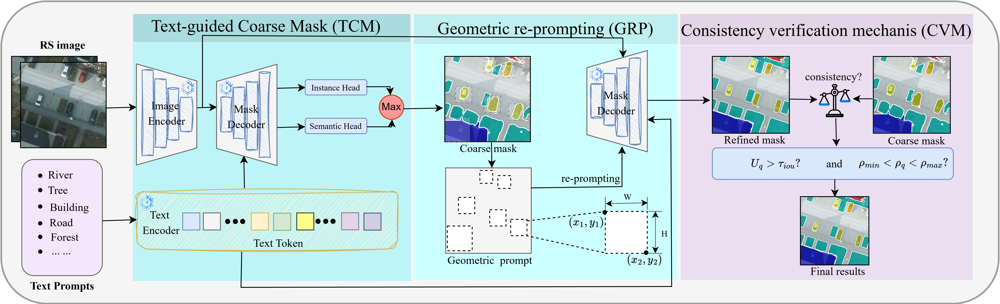

# RSGPNet
The code implementation of the RSGPNet.


### Environment
---
Please run the following script to install the SemiEarth runtime environment.
```
pip install -r requirements.txt
```

### Dataset
---
Download the processed datasets from Baidu Netdisk [Datasets](https://pan.baidu.com/s/1SHK0v0t7yYfqLBXVbkuQkA) (access code: `7342`), or from Hugging Face [Datasets](https://huggingface.co/datasets/fluorites/RSGPNet/tree/main).
Your file structure will be like:
```
├── [Your Dataset Path]
    ├── img_dir
        ├── train
        ├── val
            ├── img_001.png
            ├── img_002.png
            └── ...
    ├── ann_dir
        ├── train
        ├── val
            ├── label_001.png
            ├── label_002.png
            └── ...
```

### Demo
---
Please run the following script to start the demo.
```
python3 demo.py
```

### Evaluation
---
Please run the following script to obtain the evaluation metrics.
```
python3 eval.py
```

### Citation
---
```
@article{wang2026rsgpnet,
  title={RSGPNet: Geometric Prompting for Remote Sensing Open-Vocabulary Semantic Segmentation},
  author={Wang, Shanwen and Sun, Xin and Wang, Sirui and Zhu, Xiao Xiang},
  journal={arXiv preprint arXiv:2606.28410},
  year={2026}
}
```

### Acknowledgments
---
This implementation is based on [SAM 3](https://github.com/facebookresearch/sam3) and [SegEarth‑OV3](https://github.com/earth-insights/SegEarth-OV-3). We thank the authors for their excellent open‑source work.
